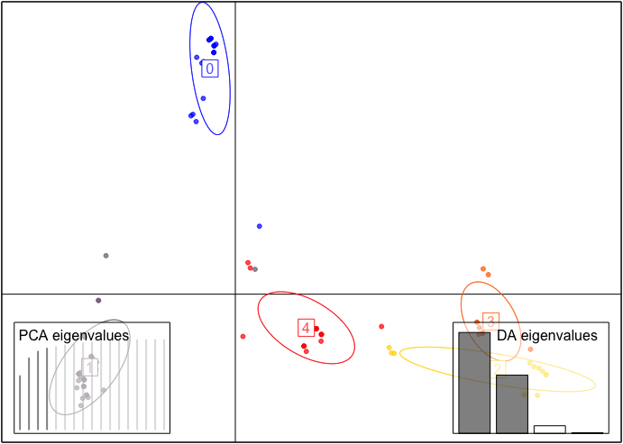
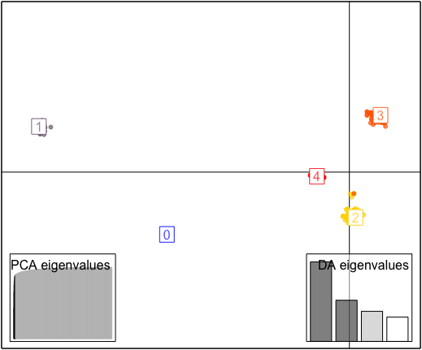

```{r, include = FALSE}
knitr::opts_chunk$set(
  collapse = TRUE,
  comment = "#>",
  fig.align = "center" 
)
```

<br>

# Introduction

`CClust` is an R package developed to help with clustering categorical datasets. The package can be installed from GitHub using devtools and then loaded in the usual way.

```{r eval = FALSE}
# Installs redres from GitHub
devtools::install_github("yudizhangzyd/CClust")
```

```{r, message=FALSE, warning=FALSE}
# Loads the package
library(CClust)
```

## Overview 

There are two main functions `kmodes` and `khaplotype` coded for clsutering categorical datasets, specifically the `khaplotype` function in this package can be used on clustering amplicon datasets with quality scores. In both `kmodes` and `khaplotype`, three k-means algorithms (Lloyd's; MacQueen's; Hartigan and Wong's algorithm) were adapted to do clustering.

## Package Structure

`CClust` is structured so the available functions fall under one of three categories. 

1. [Read data](#read_data): The first manner in which `CClust` can be used is to obtain amplicon datasets from a fastq file. This is done using the function [**`read_fastq`**](#read_fastq) to extract and return a list of data information: reads, quality scores and dimension of data.

\vspace{0.25cm}

2. [Clustering](#clustering): The second way to utilize `CClust` is to clustering categorical datasets using the following functions.

  -[**`khaplotype`**](#khaplotype): Clustering the amplicon datasets with quality scores, only random initialization is avaiable in `khaplotype`.
    
  -[**`kmodes`**](#kmodes): Clustering categorical datasets without quality information of the data, different from function `khaplotype`, it has six different random initialization methods.
    
\vspace{0.25cm}

3. [Evaluation](#evaluation): Lastly, `CClust` can be employed to evaluate the clustering result by the following functions.

  -[**`ARI`**](#ARI): Computing the Adjusted Rand Index [@Hubert1985] with the use of function `adjustedRandIndex` in package `mclust`.
  
  -[**`plot_cluster`**](#plot_cluster): Visulizing the clustering results with the use of function `dapc` in the package `adegenet`.

This vignette is set up to mimic the package structure. The sections after the introduction are dedicated to one of the three package uses. Additional details on the functions are included in these sections along with explanations of how to interpret the output and examples.

## Algorithms

Since both `kmodes` and `khaplotype` adapted three k-means algorithms (Lloyd's; MacQueen's; Hartigan and Wong's algorithm), a brief review of these three algorithms are included here.

1. Lloyd's algorithm [@Lloyd1982]

Lloyd's algorithm prescribes alternating updates of the centers with updates of the cluster assignments. The algorithm is terminated if no obseravtion is transfered after a full circle of observations.

2. MacQueen's algorithm [@MacQueen1967]

MacQueen suggested a slight modification on Lloyd's
algorithm: update the affected centers after every change to the cluster assignments. The algorithm is terminated if no obseravtion is transfered after a full circle of observations.

3. Hartigan and Wong's algorithm [@Huang1997]

Hartigan's algorithm improves on Lloyd's and MacQueen's algorithms by only assigning the observation to a new cluster if the objective function is guaranteed to improve. In particular, it takes into account any change in centers that will occur as a result of the move and makes sure that, even with this change, the value of the objective function will still be improved. Hartigan and Wong additionally define a live set to decide when to terminate the algorithm and to avoid unnecessary calculations. A cluster is no longer a live set only after a full cycle of the observations is made and none of them moved to or from that cluster.

## Initialization methods

For function `khaplotype`, only random initialization is implemented, users can set different seed.

For function `kmodes`, except for random initialization, there are 5 more initialization methods.

1. H97_RANDOM

The first of two initialization schemes proposed by @Huang1997 uses the first K observations as the initial modes. This initialization scheme is randomized in the `R` package `klaR` by selecting K distinct modes at random from the n observations.

2. HD17

@Huang1997 mentioned above interpretted by Python author de Vos [-@Vos17].

3. CLB09_RANDOM

A deterministic initialization scheme peoposed by @Cao2009.  

4. K-means++

The k-means++ initialization scheme for k-means @Arthur07 adapted to k-modes.

5. Greedy K-means++

A greedy version of the algorithm mentioned above @Arthur07.

## Example Data

`CCluster` contains three datasets, which will be used to demonstrate the functions in this vignette. 

1. The `zoo.int.data` dataset is from the UCI Machine Learning Repository [@Lichman13]. It includes one numeric coordinate, number of legs, which is treated as categorical.

2. The `sim.fastq` dataset is sampled from a subset of an amplicon dataset mentioned in the paper DADA2 [@Benjamin2016]. Accordingly, the `assignment.txt` is the true assignment of that simulation data.

<br>

# Read Fastq File {#read_data}

One of the ways to utilize `CClust` is to read the FASTQ file. This can be done using the function in the package named `read_fastq`.

## Usage

**Input**

- `datafile`: Path to a fastq file.

**Output**

- Return a list contains reads, quality socres (encoded using ASCII 33 to 126). and dim of the data.

**Functionality** 

The code below demonstrates the use of `read_fastq`.

```{r}
# Read the sim.fastq file
datFile <- system.file("extdata", "sim.fastq", package = "CClust")
dat <- read_fastq(datafile = datFile)

# Prints the head of the data
dat$reads[1:3, 1:10]
dat$quality[1:3, 1:10]
dat$dim
```

<br>

# Clustering categorical dataset {#clustering}

`CClust` has two clustering functions `kmodes` and `khaplotype`, `kmodes` is for clustering categorical datasets without quality information, `khaplotype` is for clustering datasets with quality information, now it only can be applied to amplicon datasets with quality scores.

## kmodes {#kmodes}

`kmodes` is intended to clustering the categorical datasets without quality information, it includes three unsupervised clustering algorithms and six initialization method.

**Inputs**

- `K` Number of clusters. Default is 1.
- `datafile` Path to a data file.
- `n_init` Number of initializations.
- `algorithm` Algorithm to implement clustering. The following options are available:
      -`"KMODES_HUANG"`: MacQueen's algorithm. (*default*)
      -`"KMODES_HARTIGAN_WONG"`: Hartigan and Wong algorithm.
      -`"KMODES_LLOYD"`: Lloyd's algorithm.
- `init_method` Initialization methods. The following options are available:
      - `"KMODES_INIT_RANDOM_SEEDS"`: Random sampling. (*default*)
      - `"KMODES_INIT_H97_RANDOM"`: Huang1997, randomized version.
      - `"KMODES_INIT_HD17"`: Huang1997 interpretted by Python author de Vos.
      - `"KMODES_INIT_CLB09_RANDOM"`: Cao2009, randomized version.
      - `"KMODES_INIT_AV07"`: K-means++ adapted.
      - `"KMODES_INIT_AV07_GREEDY"`: K-means++ greedy adapted.
      - ``
- `seed` Random number seed. Default is 1.
- `shuffle` Incidate if shuffle the input order. Default is FALSE.

**Output**

A list of clustering results. The following are returned detials:
- `"best_cluster_size"`: Number of observations in each cluster of the best initialization.
- `"best_criterion"`: Optimized criterion in each cluster of the best initialization.
- `"best_cluster_id"`: Cluster assignment of each observation of the best initialization.
- `"best_modes"`: Estimated modes for each cluster of the best initialization.
- `"best_seed_index"`: Seed index of the best initialization.
- `"total_best_criterion"`: Total optimized criterion of the best initialization.
- `"clsuter_size"`: Number of clusters.
- `"data_dim"`: Dimension of input data.

**Functionality**

The code below shows how to use `kmodes` by changing types of algorithms and initialization methods. If run the algorithm more than one initialization, the `kmodes` function will return results of the initialization with the minimum `total_best_criterion`, which is the best solution among all of the initializations.

```{r}
# Clustering with three initializations, default algorithm ("KMODES_HUANG") and shuffel the data with choosing K as 5
datFile <- system.file("extdata", "zoo.int.data", package = "CClust")
res_kmodes <- kmodes(K = 5, datafile = datFile, n_init = 3, shuffle = TRUE)

# Number of observations in each cluster
res_kmodes$best_cluster_size
```

```{r}
# Clustering with Harigan and Wong and K-means++ greedy adapted initialization method.
res_kmodes <- kmodes(K = 5, datafile = datFile, algorithm = "KMODES_HARTIGAN_WONG", init_method = "KMODES_INIT_AV07_GREEDY")

# Mode in each cluster
res_kmodes$best_modes
```

## khaplotype {#khaplotype}

`khaplotype` is intended to clustering the categorical datasets with quality information, now it can be only used on amplicon dataset stored in a fastq file, it includes three unsupervised clustering algorithms and there is only one initialization method: random initialization. `khaplotype` can also be applied on the datasets that used for `kmodes` if set `run_with_quals` = FALSE, however it tends to be slower when implementing Hartigan and Wong's algorithm.

**Inputs**

- `K` Number of clusters. Default is 1.
- `datafile` Path to a data file.
- `n_init` Number of initializations.
- `algorithm` Algorithm to implement clustering. The following options are available:
      - `"FASTQ_LLOYDS_EFFICIENT"`: Efficient Lloyds algorithm
      - `"FASTQ_HW_EFFICIENT"`: Efficient Hartigan and Wong algorithm (*default*)
      - `"FASTQ_MACQUEEN"`: MacQueen's algorithm
      - `"FASTQ_LLOYDS"`: Lloyds algorithm (Same as `"FASTQ_LLOYDS_EFFICIENT"` but slow, not suggested to use)
      - `"FASTQ_HW"`: Hartigan and Wong algorithm (Same as `"FASTQ_HW_EFFICIENT"` but slow, not suggested to use)
- `seed` Random number seed. Default is 1.
- `shuffle` Incidate if shuffle the input order. Default is FALSE.
- `run_with_quals` Indicate if conduct clustering on dataset with quality information. Default is TRUE.

**Output**

A list of clustering results. The following are returned detials:
- `"best_cluster_size"`: Number of observations in each cluster of the best initialization.
- `"best_criterion"`: Optimized criterion in each cluster of the best initialization.
- `"best_cluster_id"`: Cluster assignment of each observation of the best initialization.
- `"best_modes"`: Estimated modes for each cluster of the best initialization.
- `"total_best_criterion"`: Total optimized criterion of the best initialization.
- `"clsuter_size"`: Number of clusters.
- `"data_dim"`: Dimension of input data.
      
**Functionality**

The code below shows how to use `khaplotype` by changing types of algorithms. If run the algorithm more than one initialization, the `khaplotype` function will return results of the initialization with the maximum `total_best_criterion`, which is the best solution among all of the initializations.

```{r}
# Clustering an amplicon dataset and run three initializations with default algorithm ("FASTQ_HW_EFFICIENT")
datFile <- system.file("extdata", "sim.fastq", package = "CClust")
res_khap <- khaplotype(K = 5, datafile = datFile, n_init = 3)

# Number of observations in each cluster
res_khap$best_cluster_size

# The value of objective function of the best solutions
res_khap$total_best_criterion
```

```{r}
# Clustering an amplicon dataset and run three initializations with MacQueen's algorithm (shuffle the data)
res_khap <- khaplotype(K = 5, datafile = datFile, n_init = 3, algorithm = "FASTQ_MACQUEEN", shuffle = TRUE, seed = 1)

# Number of observations in each cluster
res_khap$best_cluster_size
```

<br>

# Evaluation {#evaluation}

The final way to make use of `CClust` is to compute the adjusted rand index.

## ARI {#ARI}

The function `ARI` is to compute the adjusted rand index given the estimated assignments and the true assiganments.

**Inputs**

- `est` A list of results returned from \code{khaplotype} or \code{kmodes}.
- `truth` A numeric or character vector of true assignemts.

**Output**

- A numberic value between 0 and 1, which indicates agreement between two partitions.

**Functionality** 

The code below shows how to access the clustering results using function `ARI`.

```{r}
# Estimate cluster assignments by function `khaplotype`.
datFile <- system.file("extdata", "sim.fastq", package = "CClust")
res_khap <- khaplotype (K = 5, datafile = datFile, n_init = 3)
ass <- system.file("extdata", "assignment.txt", package = "CClust")
true_assignments <- as.numeric(read.table(ass, header = F, sep = ""))

# Higher ARI means the similar between two partitions, so the clustering reasults is better
ARI(res_khap, true_assignments)
```

## Plotting {#Plotting}

The function `plot_cluster` helps to visulize clusters after using the cluster algorithms implemented in the functions. This cluster plot make use of the function \code{dapc} from package \code{adegenet} and function \code{scatter} from package \code{ade4}. The plot is based on observation assignment and discriminant analysis of principal components, therefore, when running the code, it will asks users to choose the number PCs to retain and choose the number  discriminant functions to retain.

**Inputs**

- `dat` Input data path.
- `res` Results returned from `kmodes` or `khaplotype`.
- `isFastq` Indicate if the input data is in FASTQ format.

**Output**

- A plot reflecting clustering results.

**Functionality** 
The code below shows how to plot clusters after running the clustering algorithms using function `plot_cluster`.

```{r, eval = FALSE}
# read the data and use the function `kmodes` with default setting to do the clustering
data <- system.file("extdata", "zoo.int.data", package = "CClust")
res_kmodes <- kmodes(K = 5, datafile = data, algorithm = "KMODES_HARTIGAN_WONG", init_method = "KMODES_INIT_AV07_GREEDY", n_init = 10)

# Plot the clusters
plot_cluster(data, res_kmodes)
```



```{r, eval = FALSE}
# read the data and use the function `kmodes` with default setting to do the clustering
data <- system.file("extdata", "sim.fastq", package = "CClust")
res_khap <- khaplotype(K = 5, datafile = data, n_init = 10)

# Plot the clusters
plot_cluster(data, res_khap, isFastq = TRUE)
```



# Reference
